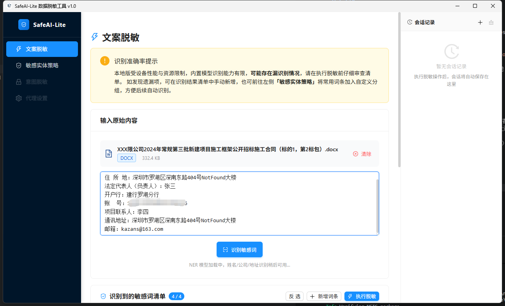
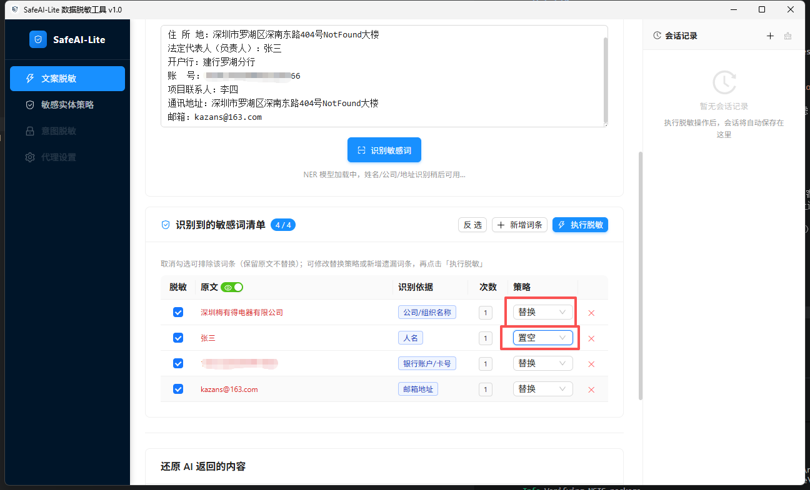
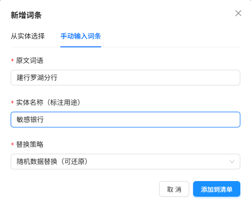
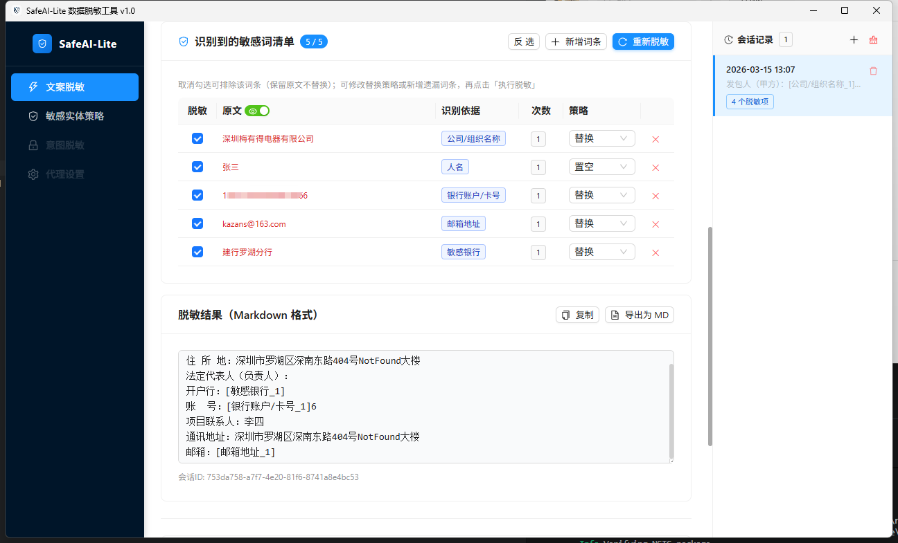
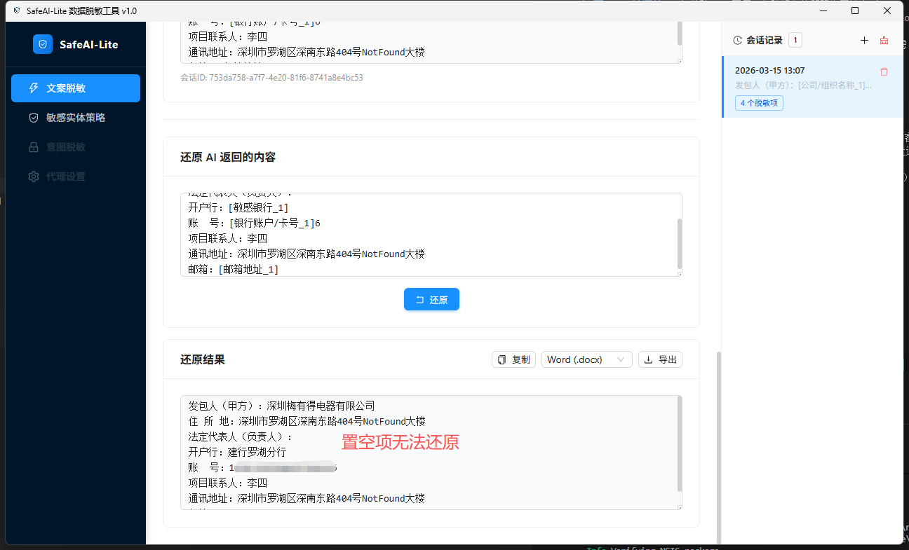

# SafeAI-Lite · 数据脱敏工具

> 在发送给云端 AI 之前，先把敏感信息藏起来；拿到 AI 回复后，一键还原真实内容。
> 全程本地运行，数据不出设备。

[](LICENSE)
[]()
[]()

---

## 目录

- [产品简介](#产品简介)
- [核心功能](#核心功能)
- [路线图](#路线图)
- [示例](#示例)
- [快速开始](#快速开始)
- [使用流程](#使用流程)
- [识别能力说明](#识别能力说明)
- [开发指南](#开发指南)
- [技术架构](#技术架构)
- [开源声明](#开源声明)
- [联系方式](#联系方式)

---

## 产品简介

SafeAI-Lite 是一款面向**个人和企业**的轻量级本地数据脱敏工具。在使用 ChatGPT、Copilot 等云端 AI 服务时，用户往往需要粘贴包含姓名、电话、合同编号、账户信息等敏感内容的文本。SafeAI-Lite 帮助用户：

1. **脱敏**：自动识别并替换敏感词为占位符（如 `[公司_1]`、`[邮箱地址_1]`）
2. **发送**：将脱敏后的安全文本发给 AI 处理
3. **还原**：把 AI 返回结果中的占位符替换回原始内容

所有脱敏操作在本地完成，无需联网，不上传任何数据。

---

## 核心功能

| 功能 | 说明 |
|------|------|
| 🔍 **智能识别** | 正则规则 + ONNX NER 模型（bert-base-chinese-ner）双引擎 |
| ✏️ **人工审查** | 识别结果可逐条确认、排除、修改策略 |
| 🔄 **一键还原** | 粘贴 AI 回复，自动将占位符替换回原文 |
| 📁 **文件支持** | 读取 `.docx/.doc/.xlsx/.xls/.pdf/.txt/.log`，导出 Word / Excel / PDF / TXT |
| 🗂️ **会话管理** | 历史脱敏记录自动保存，可随时加载重用 |
| ⚙️ **自定义实体** | 支持添加自定义敏感词组，保存后下次自动过滤 |

## 路线图
以下功能正在规划中，将在后续版本中逐步推出：

| 功能 | 说明 |
|------|------|
| 🔌 **脱敏代理服务** | 代理OpenAI API接口，无缝对接第三方 AI 客户端，在客户端调用云端 AI 时实现代理自动脱敏与还原，用户无需手动复制粘贴 |
| 🧠 **意图脱敏** | 在文案脱敏基础上进一步隐藏用户任务意图，防止通过分析任务类型推断业务敏感信息；同时对接（本地/私有部署）大模型，实现高质量意图转换与还原 |
| 💻 **代码脱敏** | 代理服务中增加（OpenAI API、Anthropic API）等支持，智能解析代码并识别其中的敏感信息（密钥、标识符、路径、数字常量等），按策略替换为占位符，同时保持代码语法正确、可编译 / 可运行 |

### 示例
---
### 读取.docx或者粘贴待脱敏文案

### 识别敏感词汇，调整脱敏策略

### 手动添加敏感实体 

### 执行脱敏

### 执行还原



---

## 快速开始

### 系统要求

- **操作系统**：Windows 10 / 11（64 位）
- **内存**：建议 4 GB 以上（NER 模型推理需要约 200 MB）
- **磁盘**：安装包约 80 MB，运行时数据存储在 `~/Documents/SafeAI-Lite/`

### 方式一：下载安装包（推荐）

1. 前往 [Releases](https://github.com/kangZan/safeai-lite/releases) 页面
2. 下载最新版 `SafeAI-Lite_x.x.x_x64-setup.exe`
3. 双击安装，启动即可使用

### 方式二：从源码构建

参见 [开发指南](#开发指南)。

---

## 使用流程

```
输入原始文本（粘贴或上传文件）
        ↓
  点击「识别敏感词」
        ↓
  审查识别清单（可增删、改策略）
        ↓
  点击「执行脱敏」→ 复制脱敏结果
        ↓
  粘贴给 AI 处理，获取 AI 回复
        ↓
  将 AI 回复粘贴到「还原」区域
        ↓
  点击「执行还原」→ 获得包含原始信息的完整回复
```

### 内置敏感实体

| 实体类型 | 识别方式 | 默认状态 |
|----------|----------|----------|
| 电话号码 | 正则 | ✅ 启用 |
| 邮箱地址 | 正则 | ✅ 启用 |
| IP 地址 | 正则 + 边界检测 | ✅ 启用 |
| 银行账户/卡号 | 正则 | ✅ 启用 |
| URL 网址 | 正则 | ✅ 启用 |
| 物理地址 | 正则 + NER | ✅ 启用 |
| 公司/组织名称 | 正则 + NER | ✅ 启用 |
| 地名机构 | NER | ✅ 启用 |
| 姓名/用户名 | NER | ⚠️ 默认关闭* |

> \* NER 模型对法律/合同等正式文体的人名识别能力有限，建议在「敏感实体策略」中手动添加常用人名后开启。

### 自定义敏感词

在「**敏感实体策略**」页面可以：
- 新增自定义实体分组（如「合同编号」「项目代号」）
- 为内置或自定义实体添加同义词（精确匹配词）
- 调整脱敏策略：**随机替换**（可还原）或**置空**（不可还原）

---

## 识别能力说明

由于本地版受设备性能与资源限制，内置模型存在一定的识别局限：

- **正则规则**：电话、邮箱、IP、银行卡等结构化数据识别准确率高
- **NER 模型**（bert-base-chinese-ner）：适合通用中文文本，对法律合同、工程文档等专业文体效果有限
- **漏识别处理**：可在识别清单中手动新增，并选择「保存到实体配置」，下次同类文档将自动识别

**建议**：执行脱敏前仔细审查识别清单，确认无遗漏后再点击执行。

---

## 开发指南

### 环境准备

```bash
# Node.js >= 18
node -v

# Rust 稳定工具链
rustup toolchain install stable
rustup default stable

# Tauri CLI
cargo install tauri-cli
```

### 克隆并安装依赖

```bash
git clone https://github.com/kangZan/safeai-lite.git
cd safeai-lite
npm install
```

### 开发模式

```bash
# 仅启动前端（Vite 热更新，端口 1420）
npm run dev

# 启动完整桌面应用（前端 + Rust 后端，推荐）
npm run tauri dev
```

### 构建发布包

```bash
# 仅构建前端
npm run build

# 构建完整安装包（输出在 src-tauri/target/release/bundle/）
npm run tauri build
```

### 类型检查

```bash
npx tsc --noEmit
```

### 项目结构

```
safeai-lite/
├── src/                        # React + TypeScript 前端
│   ├── pages/
│   │   ├── Desensitize/        # 文案脱敏主页
│   │   ├── EntityConfig/       # 敏感实体策略配置
│   │   ├── IntentDesensitize/  # 意图脱敏（开发中）
│   │   └── ProxySettings/      # 代理设置（开发中）
│   ├── components/             # 共用组件
│   ├── stores/                 # Zustand 状态管理
│   ├── services/               # Tauri invoke 封装
│   └── types/                  # TypeScript 类型定义
│
├── src-tauri/                  # Rust + Tauri 后端
│   └── src/
│       ├── commands/           # Tauri 命令处理层
│       ├── services/           # 业务逻辑
│       │   ├── desensitize_service.rs   # 扫描 & 脱敏
│       │   ├── restore_service.rs       # 还原
│       │   └── ner_service.rs           # ONNX NER 推理
│       ├── models/             # Rust 数据结构
│       ├── db/                 # SQLite 初始化 & 迁移
│       └── ner/                # ONNX 模型文件（打包内置）
│
└── README.md
```

---

## 技术架构

| 层 | 技术 |
|----|------|
| 前端框架 | React 18 + TypeScript |
| UI 组件库 | Ant Design 5 + Tailwind CSS |
| 状态管理 | Zustand |
| 桌面运行时 | Tauri 2 |
| 后端语言 | Rust |
| 本地数据库 | SQLite（via rusqlite，内嵌） |
| NER 推理 | ONNX Runtime（ort crate，CPU only） |
| NER 模型 | bert-base-chinese-ner（Xenova 量化版） |
| 文件解析 | calamine（Excel）、docx-rs（Word）、printpdf（PDF） |

---

## 开源声明

```
MIT License

Copyright (c) 2026 SafeAI

Permission is hereby granted, free of charge, to any person obtaining a copy
of this software and associated documentation files (the "Software"), to deal
in the Software without restriction, including without limitation the rights
to use, copy, modify, merge, publish, distribute, sublicense, and/or sell
copies of the Software, and to permit persons to whom the Software is
furnished to do so, subject to the following conditions:

The above copyright notice and this permission notice shall be included in all
copies or substantial portions of the Software.

THE SOFTWARE IS PROVIDED "AS IS", WITHOUT WARRANTY OF ANY KIND, EXPRESS OR
IMPLIED, INCLUDING BUT NOT LIMITED TO THE WARRANTIES OF MERCHANTABILITY,
FITNESS FOR A PARTICULAR PURPOSE AND NONINFRINGEMENT. IN NO EVENT SHALL THE
AUTHORS OR COPYRIGHT HOLDERS BE LIABLE FOR ANY CLAIM, DAMAGES OR OTHER
LIABILITY, WHETHER IN AN ACTION OF CONTRACT, TORT OR OTHERWISE, ARISING FROM,
OUT OF OR IN CONNECTION WITH THE SOFTWARE OR THE USE OR OTHER DEALINGS IN THE
SOFTWARE.
```

### 第三方组件

本项目使用了以下开源组件，感谢其作者：

- [Tauri](https://tauri.app/) — MIT License
- [React](https://react.dev/) — MIT License
- [Ant Design](https://ant.design/) — MIT License
- [Zustand](https://github.com/pmndrs/zustand) — MIT License
- [ONNX Runtime](https://onnxruntime.ai/) — MIT License
- [Xenova/bert-base-chinese-ner](https://huggingface.co/Xenova/bert-base-chinese-ner) — Apache 2.0 License

### 免责声明

- 本工具仅作为辅助手段，**不保证 100% 识别所有敏感信息**，请用户在使用前自行审查识别结果
- 本工具不对因漏识别或误识别导致的数据泄露承担任何责任
- 请勿将本工具用于任何违法用途
- 作者保证所发布的版本完全无害且不含有任何有害代码，但不对任何第三方篡改版本作出保证，请知悉
- 作者保证所发布的版本不会收集用户隐私信息，工具完全本地运行，不会往外部发送任何数据，但不对任何第三方篡改版本作出保证，请知悉
---

## 联系作者
- **邮箱**：kazans@163.com
- **GitHub**：[https://github.com/kangZan/safeai-lite](https://github.com/kangZan/safeai-lite)
- **Issue 反馈**：[https://github.com/kangZan/safeai-lite/issues](https://github.com/kangZan/safeai-lite/issues)

---

<p align="center">如果这个项目对你有帮助，欢迎点一个 ⭐</p>
